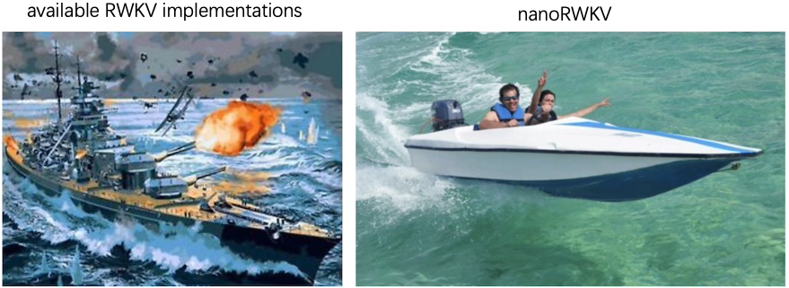
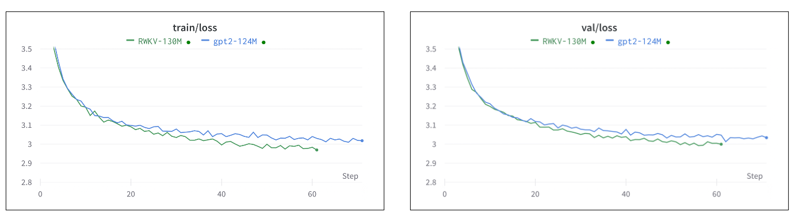
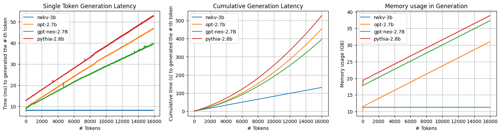
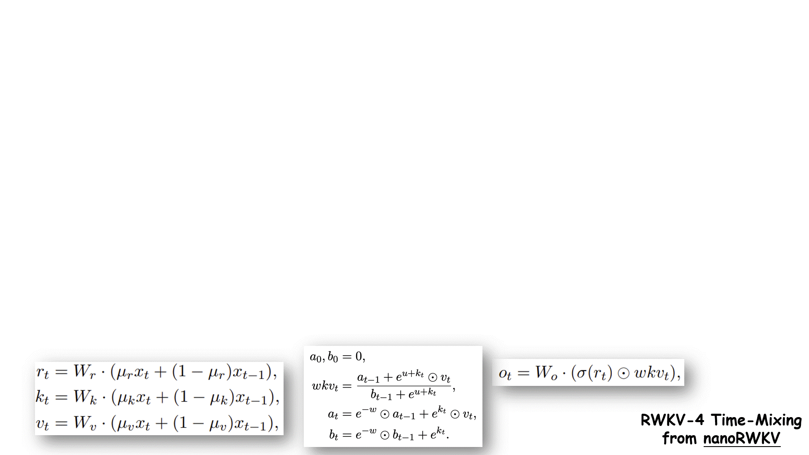
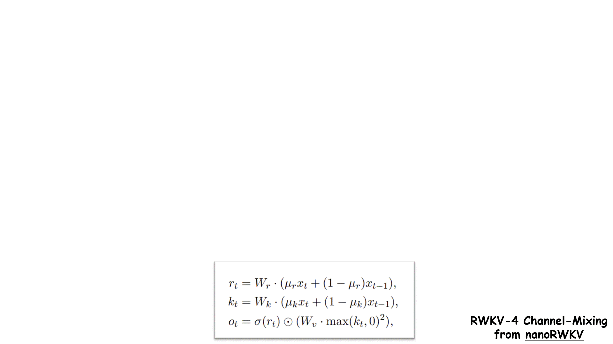

# nanoRWKV


> The [nanoGPT](https://github.com/karpathy/nanoGPT)-style implementation of [RWKV Language Model](https://www.rwkv.com) - an RNN with GPT-level LLM performance.

This is a rewrite of [RWKV-v4neo](https://github.com/BlinkDL/RWKV-LM/tree/main/RWKV-v4neo) and [HuggingFace Implementation](https://github.com/huggingface/transformers/blob/main/src/transformers/models/rwkv/modeling_rwkv.py) that aims to create a clean code base of RWKV for head-to-head comparison with GPT-series, while keeping in line with the simplicity and practicality of nanoGPT. This single repository can be utilized for training both GPT and RWKV models.



RWKV is essentially an RNN with unrivaled advantage when doing inference. Here we benchmark the speed and space occupation of RWKV, along with its Transformer counterpart (code could be found [here](https://github.com/Hannibal046/nanoRWKV/blob/main/benchmark_inference_time.py)). We could easily find:
- single token generation latency of RWKV is an constant.
- overall latency of RWKV is linear with respect to context length.
- overall memory occupation of RWKV is an constant.




## Animation
### Time Mixing


### Channel Mixing



## Table of Contents  
We organize this project as follows:
- [Installation](#installation)
    > how to set up environment to kick off this project
- [Prerequisites](#prerequisites): 
    > some concepts you should be familiar with
- [Tutorial](#tutorial)  
    > a step-by-step tutorial of building RWKV in a jupyter notebook
- [Reproduction](#reproduction)  
    > reproduce RWKV and GPT under relatively equitable conditions.
- [Generation](#generation)  
    > using trained RWKV to do generation
- [To-do-List](#to-do-list) 
    > things remaining to be done (Welcome PR)
- [Reference](#reference)
    > some useful references about RWKV and Large Language Model

## Installation
We would recommend using [Conda](https://www.anaconda.com) to manage the environment.
```
conda create -n nanoRWKV python=3.8 
conda activate nanoRWKV
pip install torch numpy transformers datasets tiktoken wandb tqdm ninja
## replace * with your driver version if loading kernel failed
# conda install cuda -c nvidia/label/cuda-11.*.0
```
## Prerequisites
Before kicking off this project, make sure you are familiar with the following concepts:
- **RNN**: RNN stands for Recurrent Neural Network. It is a type of artificial neural network designed to work with sequential data or time-series data. Check this [tutorial](http://karpathy.github.io/2015/05/21/rnn-effectiveness/) about RNN.
- **Transformer**: A Transformer is a type of deep learning model introduced in the paper [Attention is All You Need](https://arxiv.org/abs/1706.03762). It is specifically designed for handling sequential data, like natural language processing tasks, by using a mechanism called self-attention. Check this [post](http://jalammar.github.io/illustrated-transformer/) to know more about Transformer.
- **LLM**: LLM, short for Large Language Model, has taken the world by storm. Check this [Awesome-LLM repo](https://github.com/Hannibal046/Awesome-LLM) and [State of GPT](https://build.microsoft.com/en-US/sessions/db3f4859-cd30-4445-a0cd-553c3304f8e2).
- **nanoGPT**: the simplest, fastest repository for training/finetuning medium-sized GPTs by great [Andrej Karpathy](https://karpathy.ai). Here you could find the [code](https://github.com/karpathy/nanoGPT) and the [teaching video](https://www.youtube.com/watch?v=kCc8FmEb1nY).
- **RWKV Language Model**: an RNN with GPT-level LLM performance, which can also be directly trained like a GPT transformer (parallelizable). The model is created by an independent researcher [Bo Peng](https://twitter.com/BlinkDL_AI). Get more information [here](https://www.rwkv.com).

## Tutorial
We would present a step-by-step tutorial of building RWKV in a jupyter notebook.


## Reproduction

After all set up, let's build RWKV - first tokenize the dataset (OpenWebText):

```bash
python data/openwebtext/prepare.py
```

Then train RWKV(130M) with 8*V100 32GB on one node using PyTorch Distributed Data Parallel (DDP) :

```
torchrun --standalone --nproc_per_node=8 train.py config/train_rwkv.py
```

For comparision, we also train a GPT-2 model(124M) on the same device with:

```
torchrun --standalone --nproc_per_node=8 train.py config/train_gpt2.py
```

We got the results as follows (check this [wandb project](https://wandb.ai/hannibal046/nanoRWKV?workspace=user-hannibal046)):

| model | params | train loss | val loss |
| ----- | ------ | ---------- | -------- |
| GPT-2 | 124M   |  2.82      |  2.86    |
| RWKV  | 130M   |  2.85      |  2.88    |

### baselines

Existing OpenAI GPT-2 checkpoints and RWKV checkpoints allow us to get some baselines in place for openwebtext. We can get the numbers as follows:
```
python train.py config/eval_rwkv4_{169m|430m|1b5|3b|7b|14b}.py
python train.py config/eval_gpt2{|_medium|_large|_xl}.py
```
and observe the following losses on val set:
|    model   | RWKV |      |      |      |      |      | GPT-2 |      |      |      |
|:----------:|:----:|:----:|:----:|:----:|------|------|:-----:|:----:|:----:|:----:|
| parameters | 169M | 430M | 1.5B |  3B  | 7B   | 14B  |  124M | 350M | 774M | 1.5B |
|  val loss  | 3.11 | 2.79 | 2.54 | 2.42 | 2.32 | 2.23 |  3.11 | 2.82 | 2.66 | 2.56 |

Notice that both models are not trained in the openwebtext (RWKV in The Pile and OpenAI GPT-2 in private WebText), so they could be further improved due to dataset domain gap.

## Generation
After training is done, we could use the following to ask LLM to do generation:
```
python sample.py \
    --init_from=$model \
    --start="What is the answer to life, the universe, and everything?" \
    --num_samples=1 --max_new_tokens=100
```
The `$model` above could be either GPT-seris or RWKV-series:
```
#For GPT-series:
model=gpt2/gpt2-xl/gpt2-medium/gpt2-large

#For RWKV-series:
model_type=169m/430m/1b5/3b
model=RWKV/rwkv-4-{model_type}-pile
```
## To-do-list
This is not a done project and there are a lot remaining:

- [ ] Doule check the correctness of the current implementation (need help).
- [ ] benchmark generation speed and memory usage.
- [ ] A detailed and thorough jupyter notebook tutorial about RWKV.
- [ ] More code comment in [modeling_rwkv.py](modeling_rwkv.py).
- [x] RNN mode for inference [[HF Implementation]](https://github.com/huggingface/transformers/blob/main/src/transformers/models/rwkv/modeling_rwkv.py)
- [x] rescale parameters for inference [[reference]](https://github.com/BlinkDL/RWKV-LM/blob/cca1b5e8e597cf40675882bb10b46287c844e35c/RWKV-v4neo/src/model_run.py#L31)
- [x] loading RWKV checkpoint for evaluation(may not comparable to GPT-2 due to different tokenizer) 
- [x] test bf16 training (Since V100 doesn't support bf16, your sponsorship of A100 for testing bf16 would be greatly appreciated :) Thanks @Smith42 for verifying this.
- [ ] maybe scale up a little bit with DeepSpeed? Not sure, since nanoGPT didn't do this.
- [ ] keep in line with the original implementaion of RWKV optimization. [[reference]](https://github.com/BlinkDL/RWKV-LM/blob/cca1b5e8e597cf40675882bb10b46287c844e35c/RWKV-v4neo/src/model.py#L409)
- [ ] More analysis about RWKV in [scaling_laws.ipynb](scaling_laws.ipynb), [transformer_sizeing.ipynb](transformer_sizeing.ipynb)

## Reference
Here are some useful references (offering my sincerest gratitude):
- [RWKV: Reinventing RNNs for the Transformer Era](https://arxiv.org/abs/2305.13048) - the paper
- [How the RWKV language model works](https://johanwind.github.io/2023/03/23/rwkv_details.html) - a great blog post by [Johan Sokrates Wind](https://www.mn.uio.no/math/english/people/aca/johanswi/index.html).
- [Investigating the RWKV Language Model](https://ben.bolte.cc/rwkv-model) - a great post by [Ben Bolte](https://ben.bolte.cc)
- [An Attention Free Transformer](https://arxiv.org/abs/2105.14103) - a paper from Apple that inspires RWKV.
- [RWKV-in-150-lines](https://github.com/BlinkDL/ChatRWKV/blob/main/RWKV_in_150_lines.py)
- [nanoT5](https://github.com/PiotrNawrot/nanoT5) - a follow-up of nanoGPT for T5 model
- [有了Transformer框架后是不是RNN完全可以废弃了？](https://www.zhihu.com/question/302392659/answer/2954997969) - a great answer by [Songlin Yang](https://sustcsonglin.github.io)
- [RWKV的RNN CNN二象性](https://zhuanlan.zhihu.com/p/614311961) - a great zhihu post by [Songlin Yang](https://sustcsonglin.github.io)
- [Google新作试图“复活”RNN：RNN能否再次辉煌？](https://kexue.fm/archives/9554) - a great blog post by [苏剑林](https://kexue.fm/me.html)

